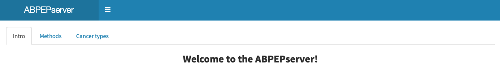

<!-- PROJECT LOGO -->
 

  

<h3 align="center">ABPEPserver: a web application for documentation and analysis of Substitutants </h3>

  

    ABPEPserver is an online database and analytical platform that offers the visualization of a large-scale tumour proteomics analysis of Substitutant expression across multiple tumour types. Functionality-wise, it offers analysis of gene-association signatures of Substitutant peptides, comparison of enrichment between tumour and tumor-adjacent normal tissues, and list of peptides that serve as candidates for immunotherapy design. ABPEPserver, hence will greatly enhance the exploration of aberrant protein production in human cancer.
     

  

<!-- TABLE OF CONTENTS -->

  
Table of Contents

  <ol>
    <li><a href="#about-the-project">About The Project</a></li>
    <li><a href="#usage">Usage</a></li>
    <li><a href="#visualization">Visualization</a></li>
    <li><a href="#contact">Contact</a></li>
    <li><a href="#acknowledgments">Acknowledgments</a></li>
  </ol>

<!-- ABOUT THE PROJECT -->
## About The Project

 

Cancer cells experience tryptophan shortage as a consequence of interferon-gamma (IFN) signaling pathway. It has been recently demonstrated that such tryptophan shortage leads to tryptophan to phenylalanine codon reassignment (W>F) resulting into aberrant peptide products. 
ABPEPserver offers the visualization of a large-scale proteomics analysis of multiple human cancer types in which aberrant peptides are detected. In this analysis, tryptophan to phenylalanine (W>F) codon reassignment were found to be a vastly abundant phenomenon in multiple cancer types. Furthermore, these W>F mis-incorporations, called W>F substitutants, were found to be enriched in tumors as compared with adjacent normal tissues, and often their appearance was associated with T-cell and oncogenic signaling activities.
Proteomic cancer data from multiple cancer types, hosted by PDC commons database, have been used in this analysis. An in depth description of how the analysis was conducted is shown in the 'Methods' tab. The 'Cancer types' tab shows cancer types analyzed and includes information about each proteomic dataset. 
This server will enable ease and fast access to aberrant peptides, which are potent immunotherapeutic targets and hence of high value.
Results are available in:

<ul><li>Barplots depicting cumulative number of W-substitutants detected in tumour and adjacent normal tissue samples.</li>
<li>Violin plots depicting the number of substitutions detected in low (intensity < 0) and high (intensity >0) tumor and adjacent normal tissue samples.</li>
<li>Scatter contour plots depicting for every gene the number of W>F substitutions when the gene is higher expressed (intensity > 0) on X-axis (High Class) and when the gene is lower expressed (intensity < 0) on Y-axis (Low Class).</li>
<li>Excel file outputs with the list of aberrant peptides.</li></ul>

<!-- USAGE EXAMPLES -->
## Usage

Use this space to show useful examples of how a project can be used. Additional screenshots, code examples and demos work well in this space. You may also link to more resources.

_For more examples, please refer to the [Documentation](https://example.com)_

(<a href="#top">back to top</a>)

<!-- VISUALIZATION -->
## Visualization

The ABPEPserver allows the user to visualize analysis result with multiple plots.

### Barplots

This shiny tab allows the upload of two files for the per transcrit comparison of the readcount disctribution along the transcript. Per sample one file is created and ending on  `rpftranscript_output.txt` and they are located in the `user_output/Diricore/` folder. 

### Violin plots

In this tab DEseq2 output files can be displayed as volcano plot including the options for filtering and visualization of specific IDs. Per comparison one` DESEQ.txt / DESEQ2.txt` and one `GENE_DESEQ.txt / GENE_DESEQ2.txt` are to be found in the `user_output/Bumpfinder` folder. The difference is that the GENE_DESEQ files are per gene and not per transcript making the visualization easier. The shiny allows the volcano plot visualization of any DESEQ2 output file that has the following columns / headers in tab separated format: ` ID	baseMean	log2FoldChange	lfcSE	stat	pvalue	padj`.

### Scatter contour plots

Here two diricore RPF plots can be compared. All comparisons are summarized in the `all_rpf_shiny.txt` file that is located in the `user_output/Diricore` folder. 

<!-- CONTACT -->
## Contact

Email: j.montenegronavarro@nki.nl

Project Link: https://github.com/jasminesmn/ABPEPserver

(<a href="#top">back to top</a>)

<!-- ACKNOWLEDGMENTS -->
## Acknowledgments

* 
* 
* 

(<a href="#top">back to top</a>)

